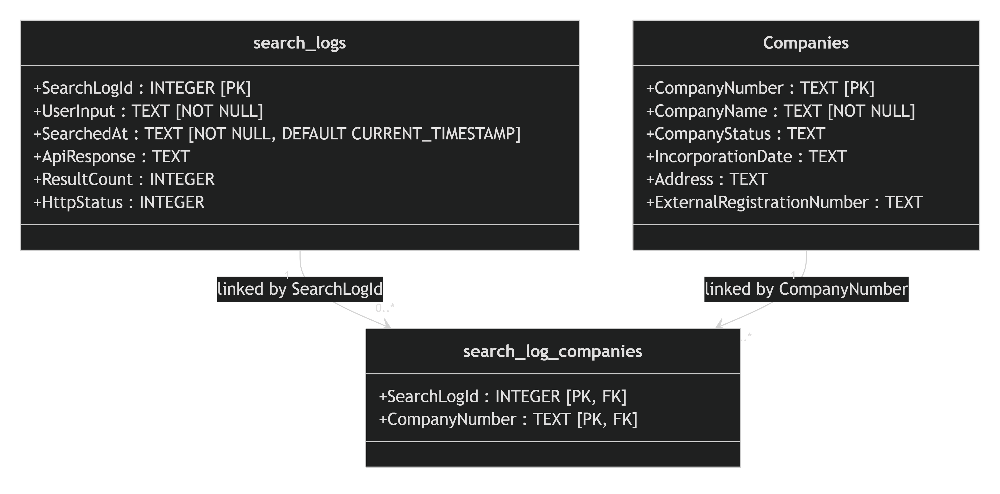

# firebrand-project

## Setting Up Your Companies House API Key

This project uses .NET User Secrets to store API keys securely. API keys are **not stored in the repository** and should never be committed to Git.

### 1. Get a Companies House API Key

Create an API key from the Companies House Developer Hub.

### 2. Add Your Key to User Secrets

From the project directory containing the `.csproj` file, run:

```shell
dotnet user-secrets set "CompaniesHouse:ApiKey" "YOUR_API_KEY_HERE"
```

## Run the backend

After saving the API key with User Secrets, run the backend from the repository root:

```powershell
dotnet run --project api/api.csproj --launch-profile https
```

The backend starts at `https://localhost:7097` and exposes Swagger at `https://localhost:7097/swagger`.

## API Calls

#### Get company by ID through the backend

```powershell
curl.exe -k https://localhost:7097/registry_id/00002065
```

#### Example Data:

```JSON
{
  "accounts": {
    "accounting_reference_date": {
      "day": "31",
      "month": "12"
    },
    "last_accounts": {
      "made_up_to": "2025-12-31",
      "period_end_on": "2025-12-31",
      "period_start_on": "2025-01-01",
      "type": "group"
    },
    "next_accounts": {
      "due_on": "2027-06-30",
      "overdue": false,
      "period_end_on": "2026-12-31",
      "period_start_on": "2026-01-01"
    },
    "next_due": "2027-06-30",
    "next_made_up_to": "2026-12-31",
    "overdue": false
  },
  "can_file": true,
  "company_name": "LLOYDS BANK PLC",
  "company_number": "00002065",
  "company_status": "active",
  "confirmation_statement": {
    "last_made_up_to": "2026-05-06",
    "next_due": "2027-05-20",
    "next_made_up_to": "2027-05-06",
    "overdue": false
  },
  "date_of_creation": "1865-04-20",
  "etag": "8259055527962f7d8a7133c1d55c10b900e50b46",
  "has_charges": false,
  "has_insolvency_history": false,
  "jurisdiction": "england-wales",
  "last_full_members_list_date": "2016-05-09",
  "links": {
    "persons_with_significant_control": "/company/00002065/persons-with-significant-control",
    "self": "/company/00002065",
    "charges": "/company/00002065/charges",
    "filing_history": "/company/00002065/filing-history",
    "officers": "/company/00002065/officers"
  },
  "previous_company_names": [
    {
      "ceased_on": "2013-09-23",
      "effective_from": "1999-06-28",
      "name": "LLOYDS TSB BANK PLC"
    },
    {
      "ceased_on": "1999-06-28",
      "effective_from": "1982-02-01",
      "name": "LLOYDS BANK PLC"
    },
    {
      "ceased_on": "1982-02-01",
      "effective_from": "1889-04-05",
      "name": "LLOYDS BANK LIMITED"
    },
    {
      "ceased_on": "1889-04-05",
      "effective_from": "1884-04-07",
      "name": "LLOYDS, BARNETTS AND BOSANQUETS BANK LIMITED"
    },
    {
      "ceased_on": "1884-04-07",
      "effective_from": "1865-04-20",
      "name": "LLOYDS BANKING COMPANY LIMITED"
    }
  ],
  "registered_office_address": {
    "address_line_1": "25 Gresham Street",
    "locality": "London",
    "postal_code": "EC2V 7HN"
  },
  "registered_office_is_in_dispute": false,
  "sic_codes": [
    "64191"
  ],
  "type": "plc",
  "undeliverable_registered_office_address": false,
  "has_super_secure_pscs": false
}
```

#### Search through the backend

```powershell
curl.exe -k "https://localhost:7097/name?name=tesco"
```
### Database
  

## Setting Up Your Companies House API Key

This project uses .NET User Secrets to store API keys securely. API keys are **not stored in the repository** and should never be committed to Git.

### 1. Get a Companies House API Key
Create an API key from the Companies House Developer Hub.

### 2. Add Your Key to User Secrets
From the project directory containing the `.csproj` file, run:

```shell
dotnet user-secrets set "CompaniesHouse:ApiKey" "YOUR_API_KEY_HERE"
```
This repository contains the database, backend, and CompanyLens Angular frontend for the client onboarding project.

## Database

See the [database guide](DB_Guide.md) for setup and usage details.


## Frontend: CompanyLens

CompanyLens is the Angular company search and verification frontend for client onboarding. It calls the local ASP.NET backend, which keeps Companies House credentials out of the browser.

## Current scope

- Search by partial company name or exact registration number
- Review and filter database-backed search activity from the top navigation
- Display company name, registration number, status, type, and registered address
- Open a separate full-profile page for each company
- Preserve the submitted query and page when navigating between results and details
- Paginate matching results at 10 companies per page
- Handle empty input, no results, loading, and service errors
- Support keyboard navigation and responsive screen sizes

Authentication, saved companies, onboarding forms, and verification decisions are outside this frontend MVP.

## Run the frontend locally

The current project was generated with Angular 22.2 and npm 11.19.

```powershell
Set-Location frontend
npm install
npm start
```

Start the backend first, then open the URL printed by Angular, normally `http://localhost:4200`. Angular proxies company requests to `https://localhost:7097`, so the browser never receives the API key.

## Verify the frontend

```powershell
Set-Location frontend
npm test -- --watch=false
npm run build
```

## Backend connection

`HttpCompanySearchService` selects `/registry_id` or `/name`, maps the backend DTOs into frontend display models, and calls `/registry_id/{id}` for details. `MockCompanySearchService` remains available for isolated component tests and local fixtures.

Queries matching eight digits or two letters followed by six digits are treated as registration numbers. Other input is treated as a company name. Company numbers must remain strings because values can have leading zeros (`00002065`) or letter prefixes (`SC123456`).

Displayed live records come from Companies House through the backend. The details endpoint maps accounts, confirmation statements, flags, previous names, SIC codes, links, and registered-office data. Fields omitted by Companies House for a particular company are shown as unavailable.

## Backend handoff

The confirmed request, response, validation, error, CORS, and API-key requirements are documented in [Backend API Contract](docs/backend-api-contract.md).

```http
GET /registry_id?registry_id=00002065
GET /name?name=Lloyds
GET /registry_id/00002065
GET /search_logs?page=1&pageSize=20&query=Lloyds
```

The first two routes return lists of `Company` results. The third route returns the profile used by the company-details page. The final route returns database search activity in reverse chronological order and can filter by search input, linked company name, or company number. Logs linked to exactly one company include its name; stored raw API responses are never exposed. Angular calls these relative paths through its development proxy.

The tested query classifier handles eight digits or two letters followed by six digits as registration numbers. The backend returns the first 100 Companies House matches, and the frontend paginates that bounded list locally. This avoids Companies House result-window errors for broad names. Components remain isolated from endpoint selection through `CompanySearchService`.

## Git workflow

Feature work is developed on dedicated branches and reviewed through pull requests into `main`; it is not pushed directly to `main`.
