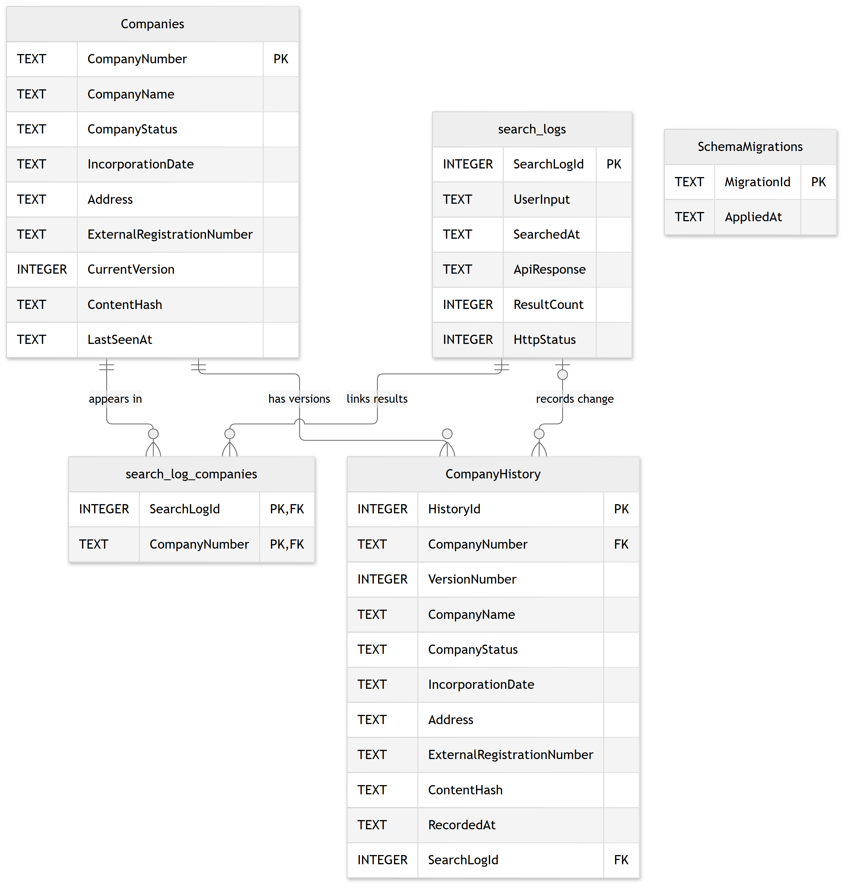
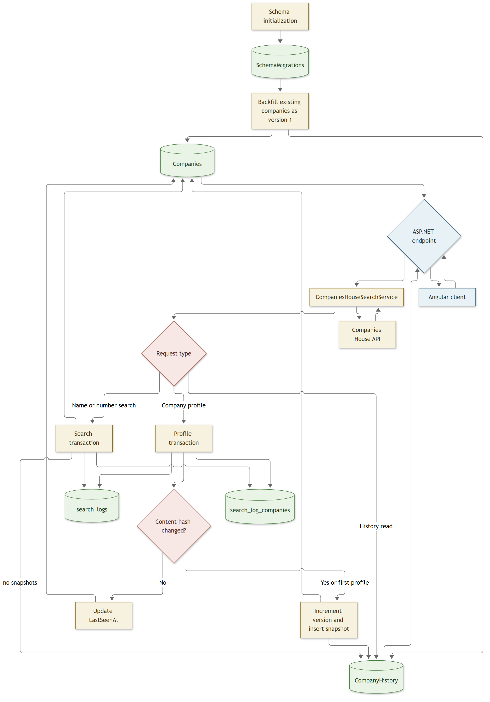

# Firebrand Project

This repository contains the SQLite database, ASP.NET backend, and CompanyLens Angular frontend for company search and client-onboarding research. The browser calls only the backend; Companies House credentials never enter the frontend.

## Current Scope

- Search by partial company name or exact registration number.
- Display current company details from Companies House.
- Record search activity and filter it by input, company name, or company number.
- Keep immutable company-profile versions when profile data changes.
- View company history newest first.
- Preserve search state, paginate results, and handle loading, empty, and error states.

Authentication, saved companies, onboarding forms, and verification decisions are outside the current scope.

## Companies House API Key

The API key is stored with .NET User Secrets and must never be committed or sent to Angular.

Prerequisites:

- .NET 8 SDK
- Node.js and npm
- A Companies House API key
- An HTTPS development certificate trusted by the local machine

If the HTTPS certificate is not already trusted, run:

```powershell
dotnet dev-certs https --trust
```

1. Create an API key in the Companies House Developer Hub.
2. From the repository root, save it for the API project:

```powershell
dotnet user-secrets set "CompaniesHouse:ApiKey" "YOUR_API_KEY_HERE" --project api/api.csproj
```

## Run Locally

Start the backend from the repository root:

```powershell
dotnet run --project api/api.csproj --launch-profile https
```

The backend starts at `https://localhost:7097`; Swagger is available at `https://localhost:7097/swagger` in development.

In a second terminal, start Angular:

```powershell
Set-Location frontend
npm install
npm start
```

Open the URL printed by Angular, normally `http://localhost:4200`. The development proxy forwards API requests to `https://localhost:7097`.

To run this checkout alongside another backend already using port 7097, start its API on a free port from this checkout's root:

```powershell
dotnet run --project api/api.csproj --no-launch-profile --urls https://localhost:7098
```

In the frontend terminal, set the proxy target before starting Angular:

```powershell
Set-Location frontend
$env:FIREBRAND_API_PROXY_TARGET = 'https://localhost:7098'
npm start -- --port 4205
```

Without `FIREBRAND_API_PROXY_TARGET`, the proxy continues to use port 7097. Each checkout has its own SQLite database, so a new worktree's activity log may initially be empty.

## API Routes

```http
GET /registry_id?registry_id=00002065
GET /name?name=Lloyds
GET /registry_id/00002065
GET /registry_id/00002065/history
GET /search_logs?page=1&pageSize=20&query=Lloyds
```

- The first two routes return bounded search results. Company numbers remain strings so leading zeros and prefixes are preserved.
- The profile route returns current company details and `version_count`. A changed profile creates a new immutable snapshot.
- The history route returns snapshots ordered by `version_number` descending.
- The search-log route returns database activity newest first. It can filter by search input, linked company name, or company number and never exposes raw upstream responses.

The full request, response, validation, and error contract is in [docs/backend-api-contract.md](docs/backend-api-contract.md).

## Database System

SQLite stores current company data separately from immutable history. Search requests update current records but do not create profile snapshots; full profile requests use a normalized SHA-256 hash to create a version only when tracked content changes.



The schema contains:

- `Companies`: latest known company data, current version, content hash, and last-seen time.
- `CompanyHistory`: immutable profile snapshots, unique by company and version.
- `search_logs`: one row per upstream request, including failures and empty results.
- `search_log_companies`: many-to-many links between requests and returned companies.
- `SchemaMigrations`: one-time schema and data migration records.

Existing company rows are backfilled as version `1` the first time the version-history migration runs. See [DB_Guide.md](DB_Guide.md) for column definitions, SQL examples, constraints, and migration details.

## Data Flow



The main persistence paths are:

1. Name and registration-number searches insert a log, upsert current company records, and create search/company links in one transaction.
2. Profile views insert a log, compare the normalized content hash, update `LastSeenAt`, and append a history row only for a first or changed profile.
3. History reads query `CompanyHistory` newest first without calling Companies House.

Editable Mermaid sources are stored beside the PNGs in `images/database-schema.mmd` and `images/database-data-flow.mmd`.

## Verify Changes

Backend:

```powershell
dotnet build api/api.csproj
dotnet test tests/Api.Tests/Api.Tests.csproj
```

Frontend:

```powershell
Set-Location frontend
npm test -- --watch=false
npm run build
```

## Git Workflow

Feature work is developed on dedicated branches and reviewed through pull requests into `main`; it is not pushed directly to `main`.