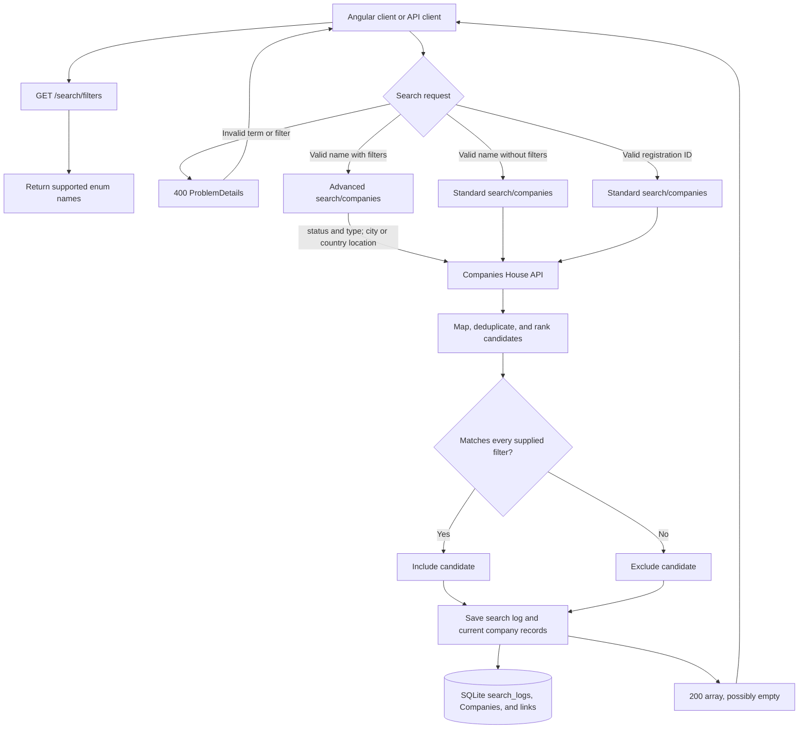
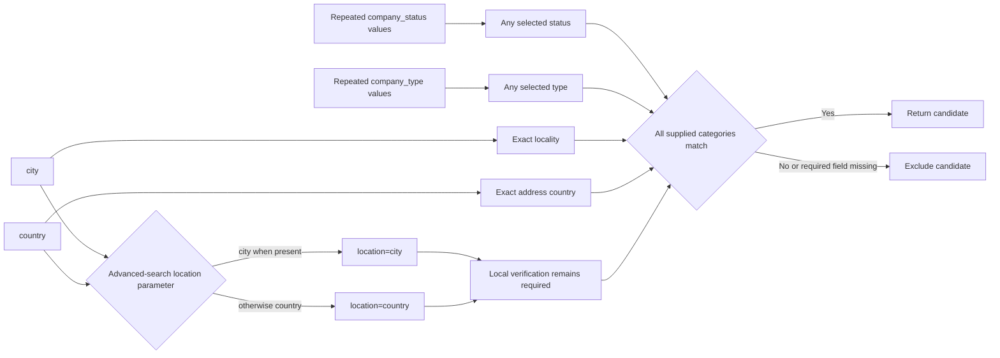

# Company Search Filtering

This guide describes the optional filters accepted by the company-search backend, how the backend applies them, and which filters are currently available in the CompanyLens UI.



## Filter Options

The frontend obtains the supported values from the backend rather than maintaining its own list:

```http
GET /search/filters
```

The response contains the enum names accepted by the search endpoints:

```json
{
  "companyStatuses": ["Active", "Dissolved"],
  "companyTypes": ["Ltd", "Plc"],
  "countries": ["England", "Scotland"]
}
```

The real response contains every value supported by `CompanyStatusFilter`, `CompanyTypeFilter`, and `RegisteredOfficeCountryFilter`. Clients must treat these arrays as the source of truth. The complete value lists are also recorded in the [backend API contract](backend-api-contract.md).

## Request Shape

Both company search routes accept the same optional query parameters:

```http
GET /name?name=Lloyds&company_status=Active&company_status=Dissolved&company_type=Plc&city=London&country=England
GET /registry_id?registry_id=00002065&company_status=Active&company_type=Plc&country=England
```

| Parameter | Accepted value | Rules |
| --- | --- | --- |
| `company_status` | One or more status enum names, such as `Active` | Repeat the parameter to select several statuses. |
| `company_type` | One or more company-type enum names, such as `Ltd` or `Plc` | Repeat the parameter to select several types. |
| `city` | Registered-office locality | Must contain 1 to 100 non-whitespace characters after trimming. |
| `country` | One registered-office country enum name, such as `England` | Only one country can be selected. |

`company_status` and `company_type` use the C# enum names exposed by `/search/filters`, not their Companies House wire values. For example, clients send `company_type=Plc`; the backend sends `company_type=plc` upstream.

## Matching Rules



- Repeating `company_status` or `company_type` has OR semantics. A company can match any selected status and any selected type.
- Different filter categories combine with AND semantics. A company must satisfy each supplied category.
- `city` is a case-insensitive exact match against `registered_office_address.locality`. It does not match a street address or formatted address.
- `country` is a case-insensitive exact match against `registered_office_address.country`.
- A company with a missing status, type, locality, or country does not match when that corresponding filter is present.
- Supplying no filters retains the existing unfiltered search behavior.

## Search Execution

### Name searches

An unfiltered `GET /name` request calls the Companies House standard company-search endpoint. A filtered name search calls the advanced search endpoint with up to the first 100 upstream candidates:

```text
advanced-search/companies
  company_name_includes=<name>
  company_status=<Companies House status value> (repeated as needed)
  company_type=<Companies House type value> (repeated as needed)
  location=<city or country>
  size=100
  start_index=0
```

Companies House provides one broad `location` parameter. The backend sends `city` when supplied; otherwise it sends `country`. It then checks every returned candidate locally against all supplied filters. This final verification prevents a broad upstream location match from being returned as a false positive.

### Registration-number searches

`GET /registry_id` always uses the standard Companies House search endpoint. When filters are supplied, the backend applies all filter checks locally to the returned candidate list. This preserves exact registration-number search behavior while ensuring its results follow the same filter semantics as name searches.

For both routes, the backend removes entries without a company number or name, deduplicates by company number, and puts current-name matches ahead of broad or historic-name matches before returning the result list.

## Validation and Responses

The search term is required for both routes. `registry_id` must contain digits, optionally preceded by two letters. The backend returns `400 Bad Request` when the search term is invalid, a filter enum is unsupported, or `city` is blank or longer than 100 characters after trimming.

The search endpoints return `200 OK` with an array, including `[]` when no company matches all filters. Filtered name searches return `[]` when Companies House reports no advanced-search results. Upstream failures use the common error contract in [backend-api-contract.md](backend-api-contract.md).

## Frontend Availability

The CompanyLens search page loads filter options from `/search/filters` and currently exposes company status, company type, and registered-office country. It preserves selected status, type, and country values in the search URL and reuses them when paging, refreshing, or returning from a profile.

The backend also supports the `city` query parameter, but the current UI does not render a city control or send this parameter. An API client can use it directly.

## Search Activity

Every upstream search is recorded in `search_logs`. When filters are present, the stored user input includes a readable filter suffix, for example:

```text
Lloyds [company_status=active,dissolved; company_type=plc; city=London; country=England]
```

Search logs retain raw upstream responses internally, while the public `/search_logs` response continues to omit them. The database data-flow documentation explains how searches update current company records and their search-log links: [database-tables-explained.md](database-tables-explained.md).

## Diagram Sources

The editable Mermaid sources are [filtering-request-flow.mmd](../images/filtering-request-flow.mmd) and [filtering-semantics.mmd](../images/filtering-semantics.mmd). They use the same source-file convention as the existing database diagrams and can be rendered to PNG when the Mermaid CLI is available.